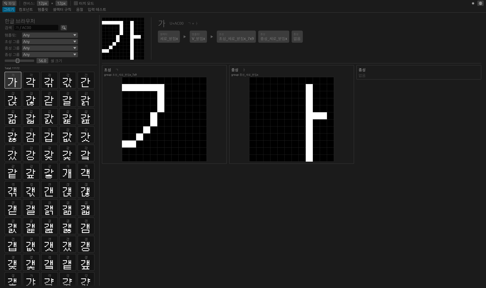
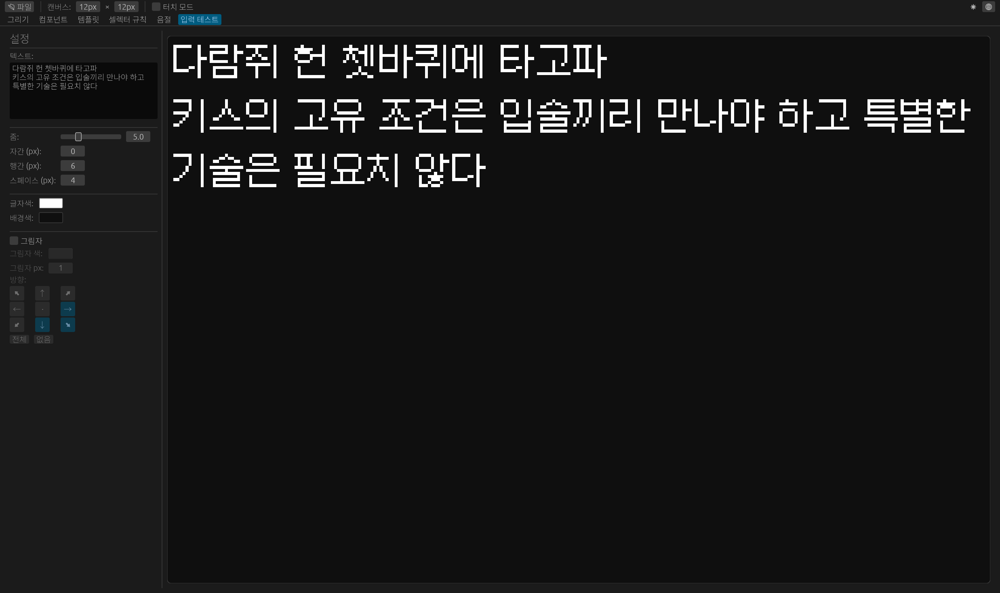

# Hangul Syllable Editor

픽셀 폰트용 한글 음절 조합 편집기입니다. 완성된 음절은 PNG로 내보낼 수 있습니다.

조합 규칙을 직접 편집하는 것에 중점을 뒀으며, 각 음절은 **셀렉터 규칙** → **템플릿** → **변형 규칙** 순서로 사용할 자모 형태가 결정됩니다.

**[최신 릴리즈 다운로드](https://github.com/yijehyung/hangul-syllable-editor/releases)** · **[웹 버전](https://yijehyung.github.io/hangul-syllable-editor/)**

---




---

## 기능

- 픽셀 단위로 자모(초성·중성·종성) 그리기
- 셀렉터 규칙 / 템플릿 / 변형 규칙 편집으로 조합 방식 커스터마이즈
- 사전 정의 프리셋 제공
- 음절 목록에서 전체 조합 미리보기
- 타입 테스트 패널로 실시간 확인
- 한글 11,172자 / KS X 1001 2,350자 / Adobe-KR-9 / 직접 지정으로 PNG 내보내기
- 스프라이트 시트 또는 글자별 개별 PNG 내보내기
- `.hangul` 프로젝트 파일로 저장/불러오기

---

## 빌드

```sh
# 데스크탑 앱
cargo build --release -p hangul-syllable-app

# CLI
cargo build --release -p hangul-syllable-cli

# 웹 (trunk 필요)
trunk build --release
```

---

## CLI 사용법

```sh
hangul-syllable-cli export \
  --project my_font.hangul \
  --out ./output \
  --mode sheet \
  --target all
```

| 옵션            | 기본값     | 설명                                                              |
| --------------- | ---------- | ----------------------------------------------------------------- |
| `-p, --project` | (필수)     | `.hangul` 프로젝트 파일 경로                                      |
| `-o, --out`     | `./output` | 결과물 출력 폴더                                                  |
| `-m, --mode`    | `sheet`    | `sheet` (스프라이트 시트) / `individual` (글자별 PNG)             |
| `-t, --target`  | `all`      | `all` · `ks-x-1001` · `adobe-kr-9` · `custom`                     |
| `--chars`       |            | `--target custom` 시 대상 글자 직접 지정                          |
| `-c, --columns` | `32`       | 시트 모드 열(column) 수                                           |
| `--text-color`  | `ffffff`   | 글자 색상 (RRGGBB hex)                                            |
| `--bg-color`    | (투명)     | 배경 색상 (RRGGBB hex)                                            |
| `--name-format` | `hex`      | 개별 모드 파일 이름 형식: `char` · `hex` · `u-hex` · `u-plus-hex` |

---

## 프리셋 출처

| 프리셋                 | 출처                                                                                  |
| ---------------------- | ------------------------------------------------------------------------------------- |
| ZIK (4×2×2)            | [ZIK님 GMS 한글 조합 렌더링](https://github.com/TandyRum1024/hangul-johab-render-gms) |
| DKB 도깨비한글 (8×4×4) | [ZIK님 GMS 한글 조합 렌더링](https://github.com/TandyRum1024/hangul-johab-render-gms) |
| MINZKN (10×6×4)        | [UnBitFonts](https://sites.google.com/site/unbitfonts/composite)                      |
| HANTERM (10×7×4)       | [UnBitFonts](https://sites.google.com/site/unbitfonts/composite)                      |

---

## License

[MIT](LICENSE-MIT) or [Apache-2.0](LICENSE-APACHE)
